# Kubernetes Troubleshooting

## kubectl get
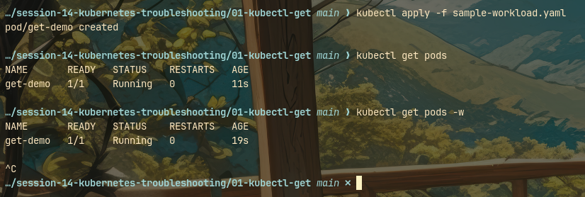

## kubectl describe
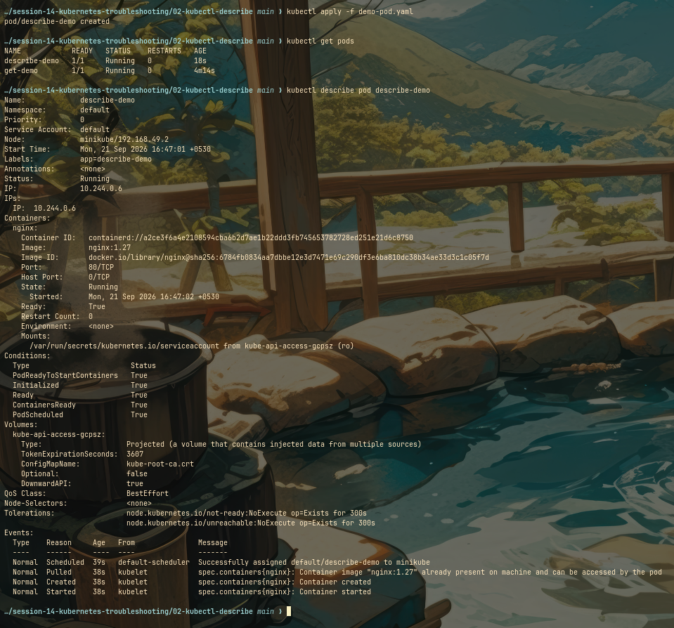

## kubectl logs
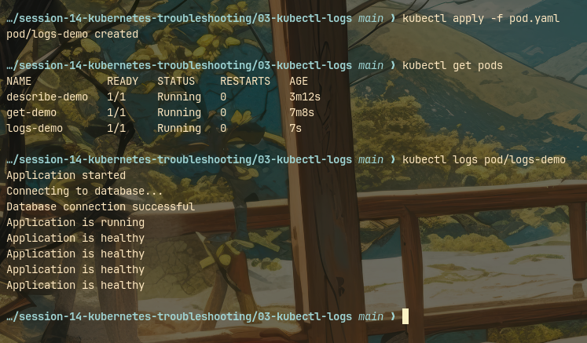

## kubectl exec
### exec ls and hostname
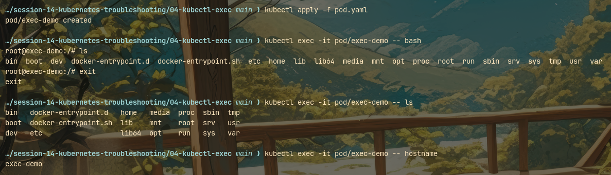

## copy docker-entrypoint
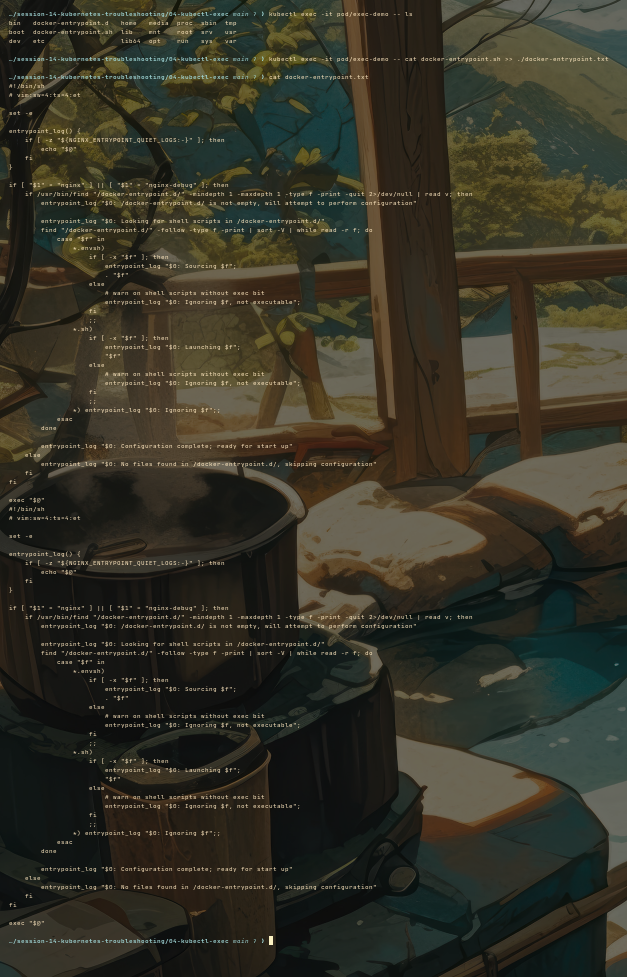

## kubectl events
### applying new pod
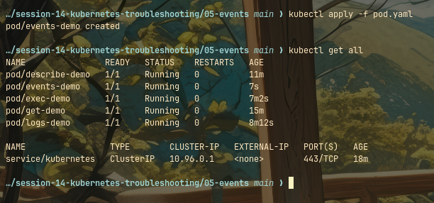

### events
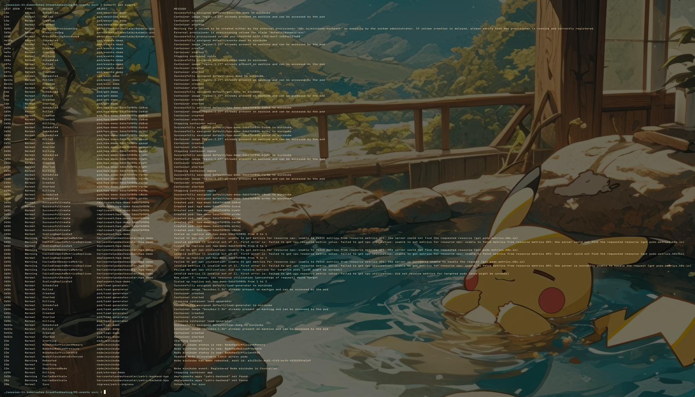

## crashloopbackoff
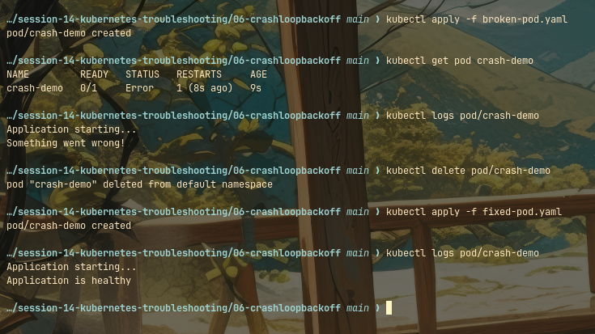

## imagepullbackoff
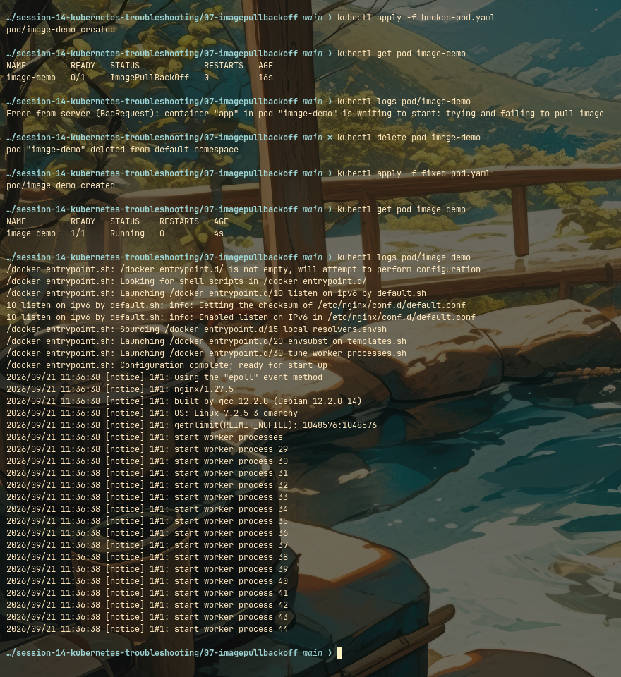

## pending pods
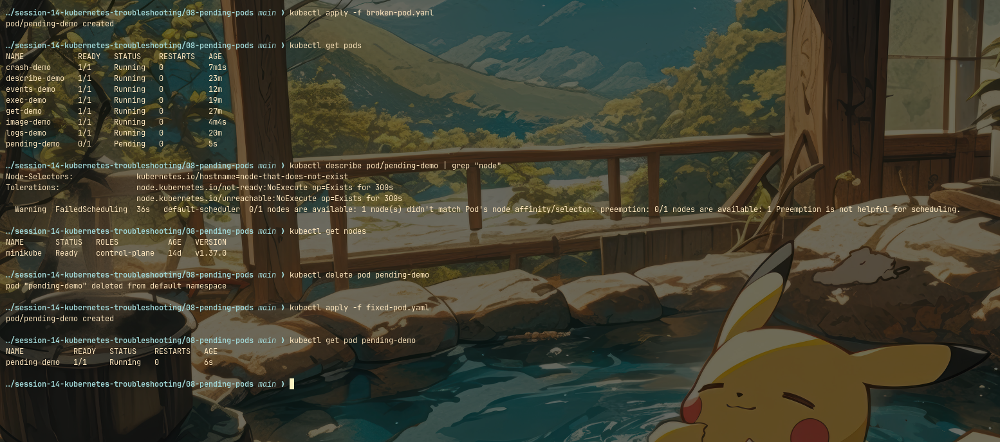

## service dns troubleshooting
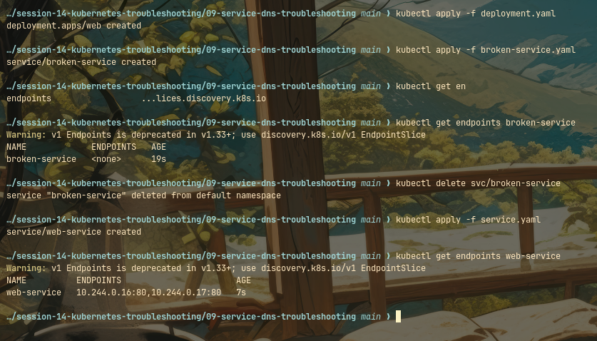

## kubectl get all
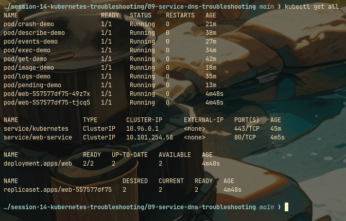

## Kubectl Logs vs Kubectl Events

The core difference lies in the source of the information: **`kubectl logs`** shows the internal output of your application's code, while **`kubectl events`** shows the cluster-level actions Kubernetes is taking to manage your resources.

### `kubectl logs` (Application Layer)

Use this when your pod is `Running` but your application is throwing code errors, failing to process data, or misbehaving. It directly reads the container's standard output and standard error streams.

**Usage Examples:**

* `kubectl logs my-app-pod` — Print the current application logs.
* `kubectl logs my-app-pod -f` — Stream the logs continuously in real-time.
* `kubectl logs my-app-pod -p` — View logs from a previous, crashed instance of the container to see why it died.

### `kubectl events` (Cluster Layer)

Use this when your pod will not start (e.g., stuck in `Pending`, `ImagePullBackOff`, or `CrashLoopBackOff`). It shows system messages from the Kubernetes control plane, such as node scheduling failures, image pull errors, or failed readiness probes.

**Usage Examples:**

* `kubectl get events --sort-by='.metadata.creationTimestamp'` — View all recent infrastructure events in the current namespace chronologically.
* `kubectl describe pod my-app-pod` — Inspect a specific pod; the cluster events explaining why it is failing to start are listed at the very bottom of the output.