# Terraform and AWS Command Reference

## AWS Configure

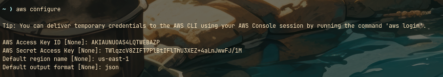

## AWS Version

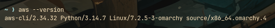

## Terraform Apply

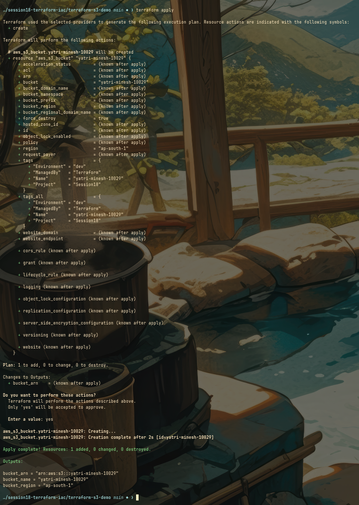

## Terraform Destroy

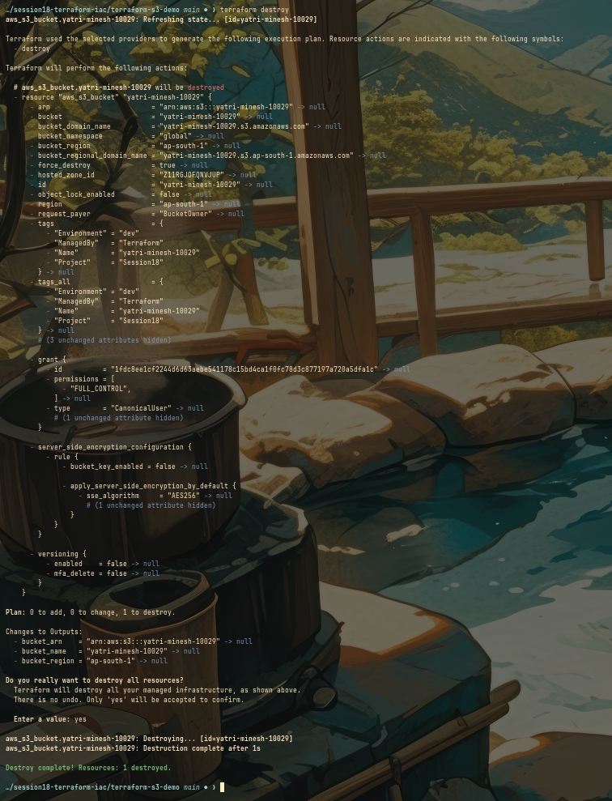

## Terraform Format and Validate

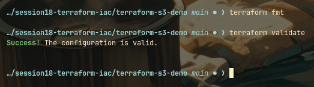

## Terraform Init

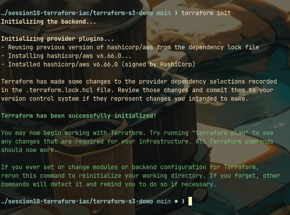

## Terraform Output

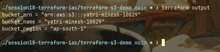

## Terraform Plan Destroy

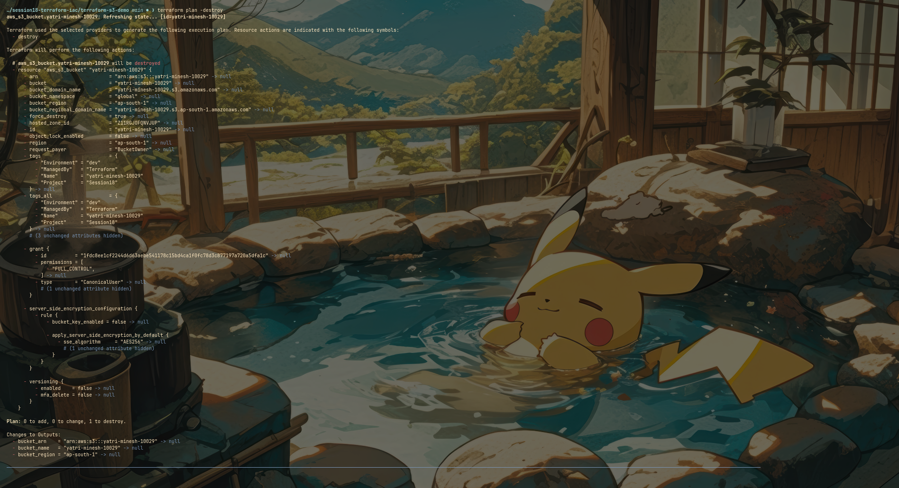

## Terraform Plan

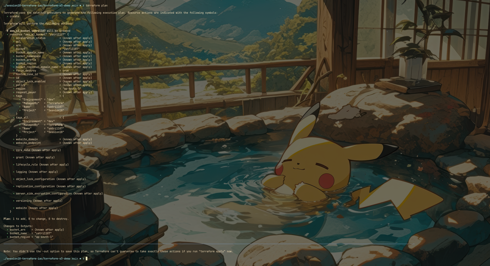

## Terraform State List

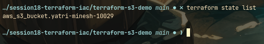

## Terraform State Show

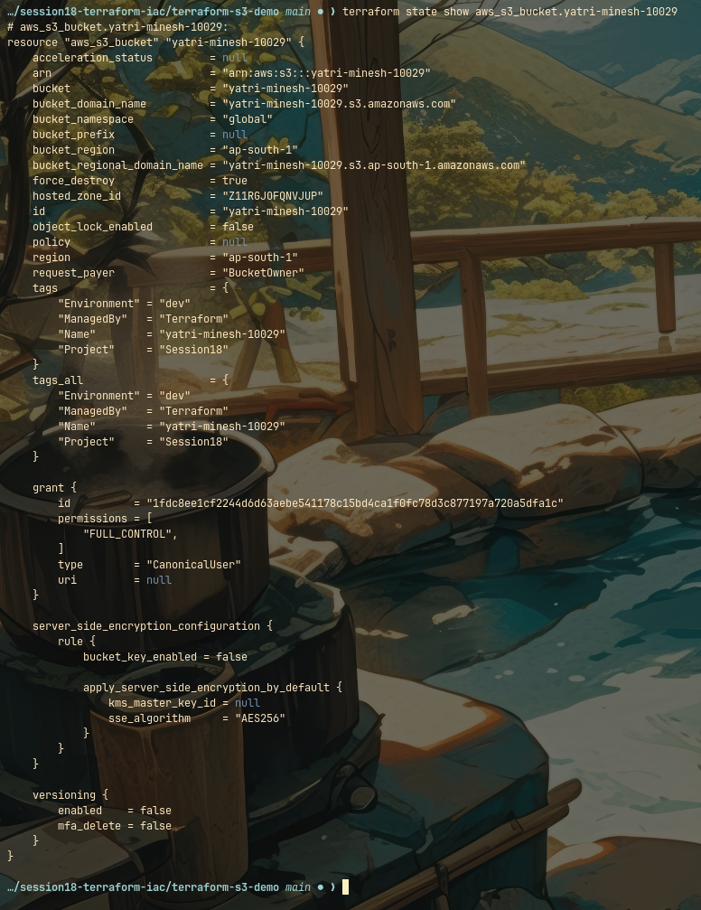

## Terraform Version

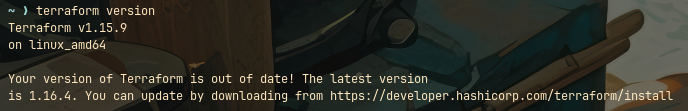